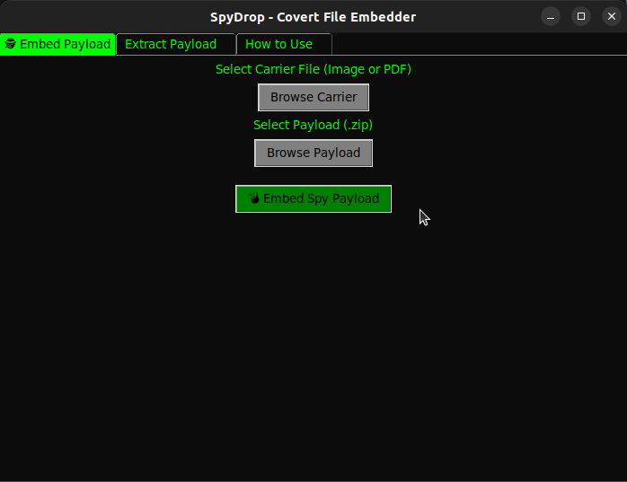
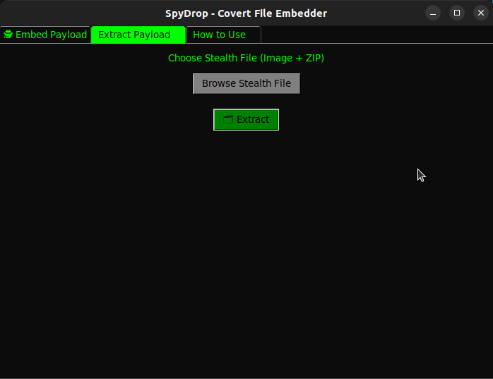
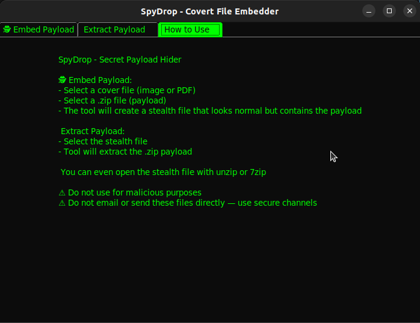

# 🕵️ SpyDrop - Hide Payloads in Plain Sight

**SpyDrop** is a covert file embedding tool that hides ZIP payloads inside seemingly innocent image or PDF files.
It uses a simple polyglot trick: appending a ZIP to a valid image doesn't corrupt the image, and ZIP extractors can still retrieve the hidden content.

## 🔍 Features

- Embed ZIP files into image/PDF files (JPEG, PNG, PDF supported)
- Extract ZIP payloads from stealth files
- Stealth files look like normal media files but secretly contain sensitive payloads
- Clean and themed GUI built with Tkinter

## 🛠 Use Cases

- Covert file storage or secure archiving
- Educational tools for cybersecurity awareness
- Basic forensics / anti-forensics demo

> ⚠️ **Disclaimer**: This tool is for educational use only. Do not use it to transmit or store malicious content.

## 🎮 How to Use

### 🔐 Embed Payload
1. Open the tool.
2. Select a carrier file (image or PDF).
3. Select the ZIP file you want to hide.
4. Save the new “stealth” file anywhere you like.

### 🧰 Extract Payload
1. Select the stealth file you embedded before.
2. Choose a directory to extract the hidden ZIP content.

### 🧪 You can also extract manually:
```bash
unzip stealth.jpg
```

### Screenshots
> 

> 

> 


